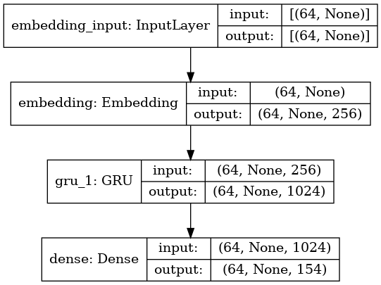

# Генериране на текст с рекурентни невронни мрежи
## Описание
Рекурентните невронни мрежи са вид невронни мрежи, които позволяват предишните изходи от мрежата да се използват при генерирането на следващите изходи чрез запазване на нелинейни скрити състояния. Поради факта, че рекурентните невронни мрежи поддържат това вътрешно състояние, което е отражение на предишните елементи ги прави подходящи за решаването на задачата за генериране на текст, тъй като следващия символ, който ще бъде генериран е зависим от символите срещнати до момента. Чрез тренирането на такава невронна мрежа можем да генерираме текст с произволна дължина символ по символ.

## Трениране
За да стартирате тренирането трябва да заредите [rnn.ipynb](./rnn.ipynb) notebook-a в <em>Jupyter</em> след като вече сте клонирали това репозитори. След като вече notebook-a e зареден променяте флага <em>TRAIN</em> в третата клетка на notebook-а от <em>False</em> на <em>True</em> и изпълнявате всички клетки. По подразбиране моделът ще бъде трениран за 150 итерации и за [корпусът от стихотворения на Иван Вазов](./data/dataset_vazov.txt) (корпус с <em>ID</em> 0). Корпусът с <em>ID</em> 1 е [корпусът от българската уикипедия](./data/dataset_wikipedia.txt), но може лесно да се промени. За трениране на Google Colab трябва да промените флага <em>COLAB</em> на <em>True</em> и папката [data](./data) да бъде качена във вашия Google Drive.

## Генериране на текст
След като тренирането приключи моделът се запазва в поддиректория на текущата директория './best_models' и може да бъде зареден от там без да се налага да се тренира отново. В notebook-a е показано как става запазването, зареждането и генерирането на текст. В [examples](./examples) може да видите примери от генерирани текстове от модели тренирани върху двата корпуса. 

## Архитектура
Архитектурата на модела се състои от 4 слоя показани на картинката по-долу.

